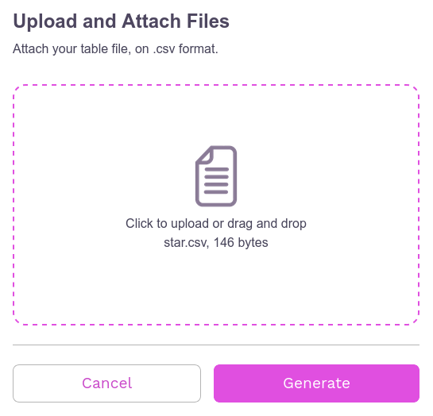
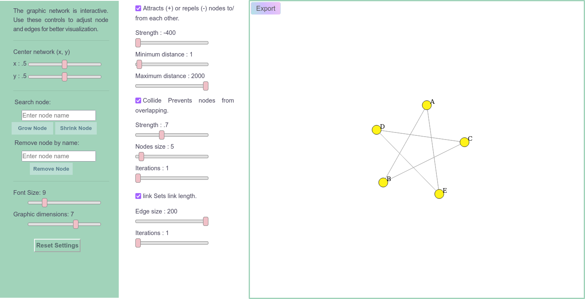
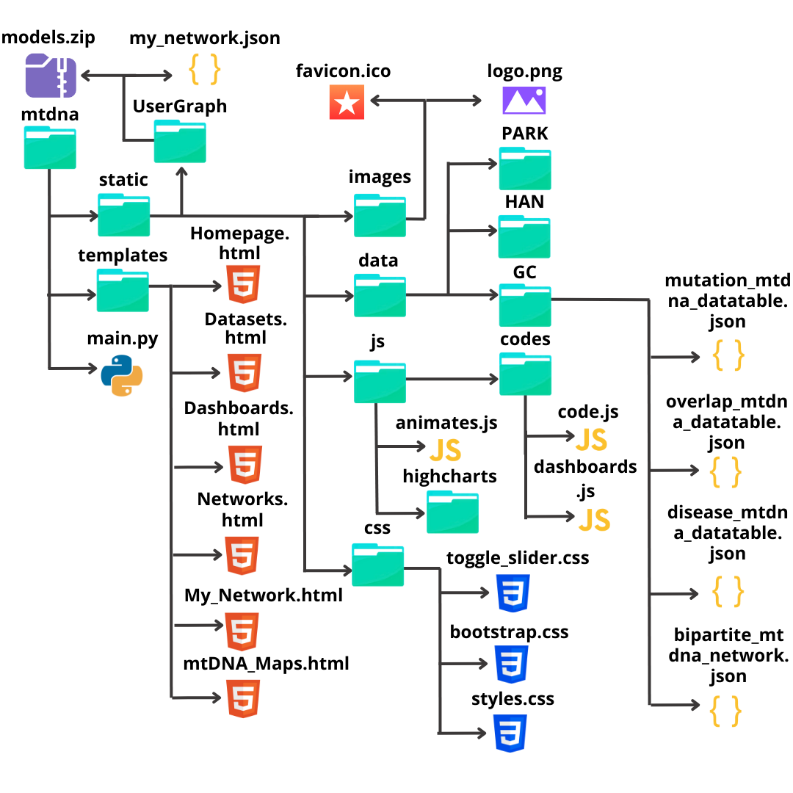
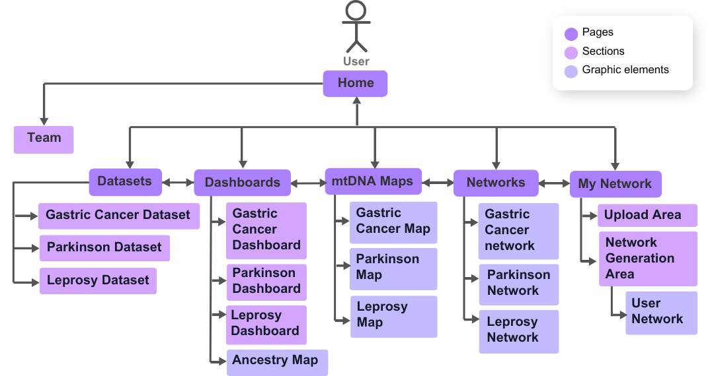

.. mtDNA documentation master file, created by
   sphinx-quickstart on Mon Nov  4 10:40:57 2024.
   You can adapt this file completely to your liking, but it should at least
   contain the root `toctree` directive.

mtDNA-Network
=============

.. .. raw:: html

..     
Este é um parágrafo com fonte menor.

Overview
--------

mtDNA-Network is a web platform aimed at analyzing and visualizing association networks between mitochondrial DNA (mtDNA) variants and complex diseases. This documentation provides a **user guide** with comprehensive details on how to use and customize the tool, as well as the data and technologies employed.

.. note::
   From version 2 onwards, the tool's entire interface layout was redesigned to make it more intuitive, informative and easier to navigate. New logos and a unique design were also created for mtDNA-Network.

Guide User
----------

This section is designed for those who want to explore the tool without diving into the underlying code.

.. tip::
   We recommend using the platform on a desktop for better interface performance.

Getting Started
~~~~~~~~~~~~~~~

Data
^^^^

The platform addressed next-generation mtDNA sequencing data from samples previously sequenced, pre-processed and genotyped by the Human and Medical Genetics Laboratory/Federal University of Pará. The samples are from patients with three different diseases, (Gastric Cancer, Parkinson and Leprosy), through the work of Cavalcante et al. (2019), together with data obtained from Yuan Y. et al., de Santos et al. (2023, under review) and de Souza et al. (2023). The disease groups have the characteristics described below.

All graphs and tables for each study present in mtDNA-Network are based on two sets of data, mitochondrial mutations and diseases/clinical forms.

.. warning::
   The variants present in all data sets published here are only the variants (somatic and germline) identified in the disease study samples represented by the central nodes, in green, of the association networks, which means that no variants were included exclusive to other diseases present in the association networks, but only the variants shared with the diseases mentioned above.

Gastric cancer samples
""""""""""""""""""""""

  The research of the gastric cancer study where the samples were collected included:

  Case (n = 40) and control (n = 50) groups with gastric tissue samples (tumor, adjacent and normal). Sequencing details and primary analyzes are provided by Cavalcante et al. (2019).

  The other types of cancer added to the network came from data extracted from The Cancer Mitochondrial Atlas - TCMA.

Parkinson samples
"""""""""""""""""

  The data samples comprise 96 individuals, divided into case and control. The case group comprises 48 patients with idiopathic Parkinson's disease, with 27 not presenting levodopa-induced dyskinesia (LID) and 21 presenting LID. The control group consists of 48 individuals without Parkinson's disease or other neurodegenerative diseases (Santos et al., 2023, under review).

Hanseniasis samples
"""""""""""""""""""

  Composed of blood samples of leprosy patients (case group, n = 33) and control individuals, healthy household contacts (control group, n = 37). The group of cases is subdivided into three subgroups according to the type of leprosy: borderline lepromatous (BL) leprosy (n = 12), lepromatous (LL) (n = 11) and borderline tuberculoid (BT) leprosy (n = 10) ( Souza et al., 2023).

.. note::

   Most of the samples came from mixed populations in Northern Brazil, since one of the problems addressed in the mtDNA-Network is the low representation of these populations in genetic studies, taking into account the rich genetic heritage of these individuals given the history of miscegenation in the country.

Pages
~~~~~

Each page of the site and its features will be described below.

Home
^^^^

In the latest version of the tool, more information was added about the data and about the tool itself to the home page. From this page you can access all other pages through the menu bar.

Features
""""""""
Both on this page and on others, several features were applied, such as interactive hidden tabs and transition effects when loading/scrolling the page and when hovering the cursor over certain elements.

   Some of these resources were modeled by the css or javascript libraries listed below: 
  
   - **Carousel**: `Bootstrap.min.css <https://maxcdn.bootstrapcdn.com/bootstrap/4.5.2/css/bootstrap.min.css>`_;
   - **Text carousel and Disease cards**: `Animate.css <https://cdnjs.cloudflare.com/ajax/libs/animate.css/4.1.1/animate.min.css>`_, a module that starts animations on elements when the page is loaded;
   - **Others cards**: `ScrollReveal <https://unpkg.com/scrollreveal>`_, a module that, through a javascript file, starts animations on elements the moment they appear on the screen.

Below is an example of an animation created with ``ScrollReveal``.

.. code-block:: javascript

    ScrollReveal().reveal('.fadeUp', {
         delay: 300,         // Delay in milliseconds
         duration: 1000,     // Duration of the animation in milliseconds
         origin: 'bottom',   // The animation should start from the bottom
         distance: '20px',   // Distance from the origin
         easing: 'ease-in-out', // Type of easing for the animation
    });

.. note::
   These last two libraries were used on the other pages as well.

Team
""""
  There is an area on the home page with information about the tool's authors.

Datasets
^^^^^^^^

On this page, a structure was defined to display data set information through HTML tables manipulated by the `DataTables plug-in <https://datatables.net/>`_ from the `jQuery <https://jquery.com/>`_ library, adding the following functions to the tables:

- **Classification**: You can reverse the display order of the rows that initially appear alphabetically in the first column by clicking the column title.
- **Filtering and/or ordering of rows and/or columns**: You can apply display filters to rows (via the search bar) and columns (via the Column Visibility button); The order of rows can be changed by **Classification** and of columns by dragging the column with the cursor to the right or left.
- **Pagination**: If the table is very large, it is displayed on different pages every 10 rows until the end of the table.
- **Search**: Common search bar.
- **Copy**: Copy the table contents to the clipboard.
- **Download**: Possibility of downloading in CSV, PDF, TXT and XLSX.

To use datatables, simply add the table contents to a JSON file, import the file in a simple javascript code and create a session for the table in HTML as in the code below.

.. code-block:: html

    

        
Mutations by Cancer Type

        <table id="mutationTable" class="display">
            <!-- The table structure will be populated by DataTables from the JSON file -->
        </table>
    

    

On the page, the tables are grouped by disease and there is a sidebar with links to all the tables and a search bar as well.

.. note::
   For smaller screens:

   - Some columns may be hidden in larger tables and can be viewed by clicking the green plus "+" icon in the first column of each row;
   - Search bars for all pages are displayed via a “magnifying glass” icon in the top left corner of the menu bar.

Networks
^^^^^^^^
This page contains graphs of the association networks for each study, created with the `D3.js <https://d3js.org/>`_ library created from information in the tables on the Datasets page, as well as all the graphs present in the tool. The graphs here are of the bipartite type, that is, they are represented by two distinct sets, in this case the set “variants” and the set “diseases”, where there are nodes (vertices) in purple represent variants (with numerical codes values ​​referring to the position mtDNA mutation), the nodes in green represent the diseases or clinical manifestations that are the focus of the results of the studies incorporated into the platform and the nodes in pink (if any) represent diseases resulting from the results of other studies, serving only as a complement to the network in this case . Edges represent variant-disease associations.

Both the networks and their personalization and analysis functionalities were implemented on the page using javascript code, where D3.js is used, in addition to several functions created to model each interactive resource. Network information was stored in JSON files that contain node titles, colors and connections.

Next to each graph there are a series of resources described below.

On the page there are 12 sliders (4 in the first column and 8 in the second, divided into 3 "check boxes"), 1 toggle slider to show/hide genes in variants, 1 reset settings button, 1 graph PNG export button, 1 search bar to highlight nodes and 1 search bar to hide nodes.

Sliders
"""""""
     - There are two sliders to move the graph on the x and y axis within the boundaries of the viewing area;
     - In the **Attracts (+) or repels (-) nodes to/from each other** checkbox, the 'Strength' slider defines the strength with which nodes attract or repel each other and the 'Minimum distance and Maximum distance sliders ' define the minimum and maximum distances at which the force is applied;
     - In the **Collide Prevents nodes from overlapping** check box, the 'Strength' slider adjusts the collision forces between nodes, the 'Edge Node' slider defines the size of the nodes and the 'Iterations' slider defines the number of iterations of the calculation of the collision force per tick of the simulation;
     - Finally, in the **link Sets link length** checkbox, the 'Edge size' slider defines the desired length of the links and the 'Iterations' slider defines the number of iterations of the link strength calculation per tick of the simulation.

.. note::
   It is also possible to change the position of the graph by double-clicking on the position the user wants the graph to move to.

Dashboards
^^^^^^^^^^
Listed below are all graphs from each dataset published to date.

Gastric Cancer Dashboard
""""""""""""""""""""""""
In this section of the page there are graphs visually showing relationships between individuals, gastric cancer and other cancers extracted from TCMA with the variants shared between them.

   **Graphics from the session:**
     - Individual Number by Mutations
     - Mutations by Disease
     - Disease Number by Mutations
     - Mutations Number by Disease
     - Jaccard Index for Disease Pairs
     - Number of Shared Variants for Disease Pairs

Parkinson Dashboard
"""""""""""""""""""
In these sessions we have graphs with data on indels, transitions and transversions identified in the study groups.

   **Graphics from the session:**
     - Sex by Age
     - Transitions Number by Group
     - Transversions Number by Group
     - Indels Count by Locus
     - Transitions Number by Group in MT-CO1
     - Transitions Number by Group in MT-CO3
     - Transitions Number by Group in MT-ND4
     - Transitions Number by Group in MT-ND5
     - Transitions Number by Group in MT-RNR2
     - Transversions Number by Group in MT-CO3
     - Transversions Number by Group in MT-ND4
     - Transversions Number by Group in MT-ND5
     - Transversions Number by Group in MT-RNR2

Leprosy Dashboard
"""""""""""""""""
In the leprosy section we have graphs with heteroplasmy and ancestry information for the case samples (in the 3 clinical forms of the disease) and control.

      **Graphics from the session:**
         - Mitochondrial Ancestry for Clinical Forms
         - Mitochondrial Ancestry for Poles
         - Variants Count by Locus
         - Heteroplasmy Level by Locus in BL
         - Heteroplasmy Level by Locus in LL
         - Heteroplasmy Level by Locus in BT
         - Heteroplasmy Level by Locus in Control
         - Heteroplasmy Average by Locus between Groups
         - Sex Number and Age by Groups

Other page extensions
"""""""""""""""""""""

- **Macro Haplogroups Map**: Geographic map graphic of the globe with distribution of samples by ancestry data.
      
      This particular chart has some additional features beyond the traditional ones added by the Highcharts library, including:
         - Possibility to change the type of geographic map between 6 different options;
         - In the **Ortographic** map type, you can 'rotate' the globe by clicking and dragging the cursor on the map;
         - It is possible to rotate the map in different directions using 3 sliders (consider *xyz* plane);
         - In the **LCC** map type, there are 2 other sliders that manipulate two parallel axes on the graph.

mtDNA Maps
^^^^^^^^^^
- **mtDNA Maps**: Here there are graphs, created with the `CGView.js <https://js.cgview.ca/>`_ library, showing the mapping of variants along mtDNA.

   The graphics contain the following features: 
      - **Reset map**: Repositions the graph to its initial position and dimensions.
      - **Zoom in and Zoom out**: Increases or decreases the graph, making it possible to view the graph with more or less information.
      - **Move Left and Move Right**: If the map is in linear view mode, these controls move the graph left and right. If the map is in circular mode, the controls will move the graph up, down, left or right, following the reference genome in an increasing or decreasing manner.
      - **Toggle Linear/Circular format**: Change the mtDNA graph viewing mode.
      - **Invert Map Colors**: Change to dark mode.
      - **Move to Random Feature and Start/Stop Animation**: Both controls will greatly zoom in on the graph showing the mtDNA GenBank reference sequence for Homo sapiens. The "Move to Random Feature" will zoom in on a random part of the sequence each time it is clicked. While "Start/Stop Animation" will start an animation zooming random parts of the sequence while the button is active.
      - **Download Map PNG and Show/Do not show data labels**: Download PNG image (with white background) and show/hide captions on the graph.
   Below is a description of the labels shown in the graph legends.
      - **CDS (Coding Sequence)**: Coding sequences, or regions of DNA that are transcribed and translated into proteins, are represented in the CDS series. Each CDS is usually represented by a colored circle that indicates the location and extent of the genes in the graph.
      - **tRNA (Transfer RNA)**: This series contains the genes that code for transfer RNA. By transporting amino acids to the ribosome, where they are incorporated into the polypeptide chain, tRNA plays an important role in the translation of the genetic code during protein synthesis. The graph presents the tRNA genes in small segments that correspond to their positions in the genome.
      - **rRNA (Ribosomal RNA)**: The rRNA series includes genes that code for ribosomal RNA, an essential part of the ribosome, the cellular machine responsible for protein synthesis. In mitochondrial DNA, there are usually genes for both 12S and 16S rRNAs. The rRNA genes appear as segments in the graph, typically larger than the tRNA genes due to their size.
      - **GC Content**: The amount of guanine (G) and cytosine (C) bases in a specific region of DNA compared to adenine (A) and thymine (T) is called the GC content. Because of the presence of three hydrogen bonds between G and C, compared to two between A and T, GC-rich regions are generally more stable than GC-poor regions. This allows analysis of GC content to reveal information about the stability of the DNA double helix. GC content is represented as a band indicating changes in GC content across the genome.
      - **GC Skew +**: The GC Skew+ measurement compares the number of guanine (G) and cytosine (C) bases in a specific region of DNA. Specifically, the result is calculated as (G−C)/(G+C). Positive values indicate an excess of G compared to C, indicating particular features of DNA transcription and replication. This series is displayed as a band indicating areas with positive GC Skew values.
      - **GC Skew -**: This is the opposite of GC Skew+. It represents areas where cytosine (C) outnumbers guanine (G). Negative values indicate a different polarity in DNA transcription or replication. This series is shown in the same range as GC Skew+, but with the GC Skew value negative, down-axis, and in a different color.
      - **Variant**: All mutations identified in gastric cancer samples.

.. warning::
   We emphasize that the sequence of base pairs shown in the graph are from the reference data taken from `NCBI <https://www.ncbi.nlm.nih.gov/nuccore/NC_012920.1>`_. Therefore, in the places where the mutations are located, it shows what the sequence of base stops should be in that exact region.

.. note::

   Due to package incompatibilities, the mtDNA graphs were allocated in a separate area (**mtDNA Maps** page) from other sections of the Dashborads page, even though it is an extension of this page.

My Network
^^^^^^^^^^
This page was created exclusively to enable the creation of interactive network graphs by users themselves.
Networks can be of any type, not necessarily graphs of relationships between mutations and diseases, and will have the same functionalities as the networks present in **Networks**. Below is a detailed description of how to create networks, with an example at the end of the tutorial.

Instructions for Generating Network
"""""""""""""""""""""""""""""""""""
To create a network, the user must create and import a table in CSV format in the **Upload and Attach Files** area of ​​the page. We chose the CSV(Comma-Separated Values), format to import the table because it has a simple structure and makes it possible to create a lightweight file, even with a large volume of data. Furthermore, in this format the user is free to include data from other works or databases in their network and not just data from their research.

.. tip::
   In the .csv format, columns are separated by certain delimiters, usually by commas ( , ) as the name suggests, but depending on the way these files are created, other characters can also be used for this, such as semicolons ( ; ) or tab (/t). **To avoid errors, make sure your table uses a comma ( , )** as a delimiter. It is possible to determine this when creating these files in certain IDEs such as RStudio or Visual Studio Code or even creating the table in Excel and exporting it in this format or exporting it in XLSX and converting it later on online sites, such as `convertio <https://convertio.co/pt/xlsx-csv/>`_.

.. note::
   Data strings (text) and column titles may or may not be enclosed in double quotation marks ("), but avoid mixing the two formatting options. In the template provided, the information is enclosed in double quotation marks.

The table must contain three columns with the following titles, in the same order as the list:

1. **nodes_id**: Contains the titles of all nodes in the network, which can be names of diseases, genes, mutations, proteins, etc;
2. **nodes_color**: In this column the color of the node is defined, where you can choose between the following color options:
   
.. raw:: html

   

     <strong style="font-size: 14px; color:#62ff00 !important;">⬤</strong> lime
   

   

     <strong style="font-size: 14px; color:#fff319 !important;">⬤</strong> yellow
   

   

     <strong style="font-size: 14px; color:#ffaa43 !important;">⬤</strong> orange
   

   

     <strong style="font-size: 14px; color:#ff5b5b !important;">⬤</strong> red
   

   

     <strong style="font-size: 14px; color:#ff7d71 !important;">⬤</strong> salmon
   

   

     <strong style="font-size: 14px; color:#ff7bb2 !important;">⬤</strong> pink
   

   

     <strong style="font-size: 14px; color:#d966ff !important;">⬤</strong> violet
   

   

     <strong style="font-size: 14px; color:#ae7bff !important;">⬤</strong> purple
   

   

     <strong style="font-size: 14px; color:#82a3ff !important;">⬤</strong> blue
   

   

     <strong style="font-size: 14px; color:#2dd5ff !important;">⬤</strong> aqua
   

   

     <strong style="font-size: 14px; color:#5dd673 !important;">⬤</strong> green
   

   

     <strong style="font-size: 14px; color:#a1c23c !important;">⬤</strong> olive
   

.. tip::
   - In the **nodes_color column** it is possible to add 12 different colors for the nodes, if there are more types of nodes in your network, you can choose one of the available colors and place it on all lines.
   - In the **connected_nodes column** it is not necessary to repeat the connections, that is, if you have already defined in one line: the node “disease-1” in “nodes_id” and “variant-1” in “connected_nodes”, it is not necessary put “disease-1” in the “connected_nodes” column of the “variant-1” node row, leaving the value blank in this case. Note that in our models, we only place values ​​in the “connected_nodes” column in rows with nodes from the “green” category in the “nodes_color” column, as there are only two categories of nodes and the central node, connected to all other nodes in this example.

3. **connected_nodes**: This column will add the edges of the graph, in it you place the nodes connected to the node in the “nodes_id” column. You can place one connected node per line, so if there is more than one connection to the same node, you must repeat the same line, replacing only the value in “connected_nodes” or you can place all connected nodes on the same line, but separated by tabulation ( | ), if you choose this method, the table delimiters cannot under any circumstances be this character ( | ).

After finishing the CSV, making sure it is correctly formatted, the file can now be imported onto the page. When importing it, the file name and the amount of memory it occupies will appear. If the user wishes, it is possible to remove the import by clicking **Cancel**, if you wish to continue, simply click **Generate** to process the file and create the network visualization.

Example
"""""""
This subsection will show the creation of a network generated from a table called **star.csv**, as it forms a graph that resembles a star.

Below is the content of the file and what the table would look like.

CSV
###

.. code-block:: csv
    :linenos:

    "node_id","node_color","connected_nodes"
    "A","yellow","B | E"
    "B","yellow","A | C"
    "C","yellow","B | D"
    "D","yellow","C | E"
    "E","yellow","D | A"

Table
#####

+-----------+-------------+--------------------------------------------------+
| node_id   | node_color  | connected_nodes                                  |
+===========+=============+==================================================+
| A         | yellow      | B | E                                            |
+-----------+-------------+--------------------------------------------------+
| B         | yellow      | A | C                                            |
+-----------+-------------+--------------------------------------------------+
| C         | yellow      | B | D                                            |
+-----------+-------------+--------------------------------------------------+
| D         | yellow      | C | E                                            |
+-----------+-------------+--------------------------------------------------+
| E         | yellow      | D | A                                            |
+-----------+-------------+--------------------------------------------------+

On page
#######

   

When clicking on Generate we have:

.. raw:: html

   

.. note::
   On the page there are some template options to download and edit (in CSV and XLSX).

.. warning::
   - Any graphic created will be deleted when leaving the page; 
   - Do not change the column names or the table structure; 
   - The "node_color" column is only used to define the color of the nodes, so any text other than the 12 options will not be identified and the node will be gray.

Technical information
---------------------
Just like the networks present in the tool, those created here will be modeled by the D3.js library, with all the features of the others, except the **show locus** feature (present in networks in Networks). 

Within the project there is an empty JSON file that is filled with JavaScript code that converts the content of the user's CSV table to JSON format and stores this information temporarily (until the user exits or reloads the page). When importing the CSV and clicking on **Generate**, the code is "activated" and then the JSON file is filled in and another javascript code manipulates this JSON, together with D3.js to generate the network on the page.

To make this possible, the `Flask-Cors API <https://pypi.org/project/Flask-Cors/>`_ extension was used to enable the **CORS** (Cross-Origin Resource Sharing) API in the project's main.py, to allow the frontend to make requests to the backend from origins (domains ) different, without causing errors related to CORS security.

To allow the "writing" of empty JSON within the project by external sources (in this case, users), the **HTTP POST** method was used. POST is used to send data to the server, and in this case, it is used to save the JSON content sent to the file on the server from processing the user's CSV file.

.. note:: 
   - The API had to be installed on the tool's hosting server, `PythonAnyWhere <https://www.pythonanywhere.com/>`_;
   - This server was used for the mtDNA-Network, due to the use of the python micro-framework `Flask <https://flask.palletsprojects.com/en/stable/>`_ in the project.

Below is a simplified version of the **main.py** file showing some of the imported modules, the logic for processing data on the **My Network** page and the rendering of the project with an example for the home page (the same applies to other pages).

Simplified main.py
~~~~~~~~~~~~~~~~~~

.. code-block:: python
    
    # other modules
    from flask_cors import CORS
    from flask import Flask
    from flask.templating import render_template
    from flask import Flask

    app = Flask(__name__)
    CORS(app)

    # Define the path where the JSON file will be saved
    SAVE_PATH = os.path.join(app.root_path, 'static', 'UserGraph', 'My_Network.json')

    @app.route('/clear-json', methods=['POST'])
    def clear_json():
        # Open the file at SAVE_PATH in write mode and clear its contents
        with open(SAVE_PATH, 'w') as f:
            f.write('')  # Clears the content of the file

    @app.route('/upload-json', methods=['POST'])
    def upload_json():
        # Get the JSON content from the request body
        json_content = request.get_json().get('fileContent')

        if json_content:
            # If content is found, open the file at SAVE_PATH in write mode and save the content
            with open(SAVE_PATH, 'w') as f:
                f.write(json_content)

    app._static_folder = 'static'

    @app.route('/')
    def page():
     return render_template('home.html')

    if __name__ == '__main__':
     app.run(debug=True)

Project organization
~~~~~~~~~~~~~~~~~~~~
Below is an image showing how the project's parent folder and its files were organized.

.. note::
   Due to the large number of files (285 in total), only the main folders and files are shown in the image.

Pages structure
~~~~~~~~~~~~~~~
Below is a use case diagram, which shows the possible user movements through the mtDNA-Network pages.

.. toctree::
   :maxdepth: 2
   :caption: Contents:

..    This project is under active development.

